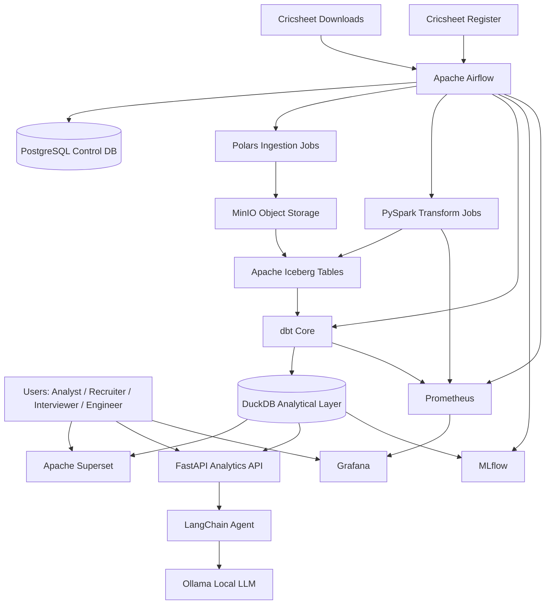
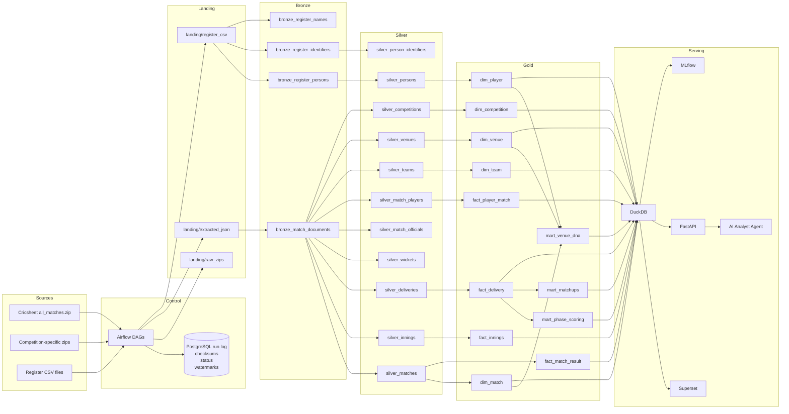

# Cricket Intelligence Platform — Comprehensive High Level Design and High Level Architecture

> Document type: HLD / HLA  
> Intended audience: engineering review, architecture discussions, implementation planning, portfolio documentation, interview preparation  
> Architecture style: open-source, cloud-agnostic, lakehouse-oriented, analytics-first, AI/ML extensible

## 1. Executive overview

The Cricket Intelligence Platform is a cloud-agnostic, open-source data platform designed to ingest, process, model, and serve historical cricket data from Cricsheet at scale. Cricsheet publishes structured match data in JSON as its main format, with legacy YAML and experimental CSV/XML variants, and the platform’s downloads page currently exposes more than 21,000 matches in the full archive. The source ecosystem also includes the Cricsheet Register, which provides unique identifiers, cross-site identifier mappings, and name variations for thousands of cricket people, making proper identity resolution feasible instead of relying on raw player-name strings.[1][2][3][4][5][6]

This platform is intentionally designed to look and behave like a modern product-company data platform rather than a hobby analytics project. It combines an object-store-based lakehouse, workload-specific compute engines, governed analytics modeling, business-facing dashboards, AI-assisted analytical experiences, and MLOps capabilities in a single coherent architecture.[7][8][9][10][11]

The architectural goal is not only to build something functional, but to create a platform that sharpens the right skills for long-term career growth: distributed data processing, open table formats, orchestration, warehouse-style modeling, quality engineering, observability, AI enablement, and ML lifecycle management.[12][13]

## 2. Vision and goals

### 2.1 Vision

Build a reusable **Cricket Intelligence Platform** that transforms public structured cricket data into a trusted analytical and intelligent product foundation. The system should support both current needs, such as dashboards and curated analytics, and future expansion into conversational analytics, predictive modeling, and eventually streaming or near-real-time use cases.[5][14][1]

### 2.2 Primary objectives

- Build a portfolio-grade open-source platform that demonstrates senior-level data engineering architecture and implementation choices.
- Use technologies that are relevant to modern startups and product companies while avoiding tight vendor lock-in.[8][10][7]
- Separate storage, compute, orchestration, modeling, serving, and observability concerns so the platform can evolve without full rewrites.[15][7]
- Build a governed analytical layer that can power dashboards, APIs, AI agents, and ML workflows consistently.[9][10][11]
- Create a migration-friendly design whose components map cleanly to managed cloud services later.[7][8]

### 2.3 Success criteria

A successful v1 should:
- ingest the full Cricsheet historical archive reproducibly,[1]
- model the Cricsheet Register as a canonical identity layer,[5]
- produce Bronze, Silver, and Gold datasets on an open table format,[12][7]
- expose curated marts for dashboards and downstream consumers,[10][9]
- implement observable, testable, restartable pipelines,[14][8]
- support at least one AI assistant use case and one ML use case grounded on curated data.[11][13]

## 3. Architectural principles

### 3.1 Decoupled storage and compute

The platform separates physical data storage from processing engines so that data remains durable and reusable even if the compute layer changes over time. This is the same principle behind modern lakehouse architectures, where multiple engines can read and write shared analytical tables without data duplication or deep coupling to one vendor runtime.[15][7][12]

### 3.2 Open format first

Apache Iceberg is chosen as the primary table format because it supports in-place schema evolution, partition evolution, and snapshot-based table management while remaining open and multi-engine compatible. That matters because this project is explicitly intended to grow across multiple compute and serving patterns over time.[7][12][15]

### 3.3 Right tool for each workload

Not all workloads in this system are the same. Ingestion of thousands of relatively small structured files has different performance characteristics than multi-stage historical joins or sub-second analytical querying, so the architecture intentionally uses different engines for different jobs.[16]

### 3.4 Contract-driven movement across layers

Data is allowed to advance from one layer to the next only after satisfying structural and semantic checks. This principle makes the platform more trustworthy and also gives strong interview talking points around data quality and engineering discipline.[17][9]

### 3.5 Analytics as a product

The Gold layer is treated as a product interface rather than as an incidental transformation output. Dashboards, APIs, AI assistants, and ML feature extraction all depend on this governed analytical contract.[9][10][11]

### 3.6 AI and ML must be grounded

AI and ML layers sit on top of curated marts, dimensions, and feature views rather than raw JSON files. That minimizes hallucination risk for AI and leakage or inconsistency risk for ML.[13][11]

## 4. Source system understanding

### 4.1 Cricsheet as the primary source

Cricsheet provides freely available structured cricket data, including ball-by-ball match records and identifier mapping through the Register. The downloads page offers archives by match type, competition, gender, year, country, and team, and the “all matches” archive includes over 21,600 matches with a small number withheld. The matches page also exposes aggregate counts and downloadable samples in JSON and YAML.[2][6][1]

### 4.2 Formats and implications

Cricsheet supports JSON, YAML, XML, and two CSV variants, but JSON is now the modern default and should be treated as the canonical ingestion format for the platform. This is important because future-proofing the project means optimizing for the actively maintained source structure rather than the legacy format.[3][4][18]

### 4.3 Register as identity backbone

The Cricsheet Register contains unique identifiers for more than 17,700 people, tens of thousands of identifiers from 12 external sources, and thousands of name variations. This is one of the strongest differentiators of the project because it enables a robust `dim_person`, crosswalk tables, and entity resolution logic that most sports-data side projects ignore.[6][5]

### 4.4 Source data characteristics

The JSON files are nested and hierarchical, with match metadata, participant identities, innings, overs, deliveries, wickets, extras, officials, and outcomes represented within the same source document. This implies:[18]
- a raw landing and Bronze design that preserves source fidelity,[18]
- a Silver normalization process that can explode nested arrays safely,
- and an analytical design where the delivery fact table becomes the most important grain for deep cricket analytics.

## 5. Scope

### 5.1 In scope for v1

- Historical batch ingestion from Cricsheet downloads.[1]
- Register ingestion and identity modeling.[5]
- Bronze, Silver, and Gold layers on object storage.[7]
- Workflow orchestration with Airflow.[8]
- Workload-specific transformation using Polars and PySpark.[16]
- dbt Core modeling and tests for Gold marts.[9]
- Superset dashboards for executive and analyst use cases.[19][10]
- MLflow-managed first predictive workflow.[11][13]
- FastAPI and local LLM-backed AI analytical assistant.[20]
- Observability and quality monitoring.[14][17]

### 5.2 Deferred scope

- Real-time scoring ingestion from live feeds.
- Kafka-centered streaming architecture.[14]
- Kubernetes-native Spark or Kubeflow-first deployment model.
- Multi-tenant SaaS exposure for external users.
- External commercial enrichment feeds.

## 6. High level architecture

### 6.1 Logical platform view

The platform is divided into eight logical layers:

1. **Source layer** — Cricsheet archives and Register files.[1][5]
2. **Control and orchestration layer** — Airflow plus PostgreSQL control metadata.[8]
3. **Raw and lake storage layer** — MinIO as S3-compatible object storage.
4. **Open table layer** — Apache Iceberg-managed tables.[12][7]
5. **Compute and transformation layer** — Polars and PySpark for workload-appropriate processing.[16]
6. **Analytics engineering layer** — dbt Core for SQL models, tests, and docs.[9]
7. **Consumption and intelligence layer** — DuckDB, Superset, FastAPI, Ollama, LangChain, MLflow.[10][20][11]
8. **Observability layer** — Prometheus, Grafana, data quality outputs, and run metadata.[17][14]

### 6.2 System context diagram



### 6.3 Detailed data flow diagram



## 7. Technology stack and decision rationale

### 7.1 Recommended stack

| Layer | Primary choice | Why this choice |
|---|---|---|
| Object storage | MinIO | S3-compatible local-first object storage; easy portability to cloud object stores later. |
| Table format | Apache Iceberg | Open, multi-engine, supports in-place schema and partition evolution.[12][15] |
| Orchestration | Apache Airflow | Mature DAG orchestration, metadata-driven control, retries, dependencies, backfills.[8][14] |
| Ingestion compute | Polars | Excellent for high-speed parsing of many smaller files on a single machine.[16] |
| Transform compute | PySpark | Best fit for scalable historical normalization and complex joins. |
| Analytical engine | DuckDB | Fast local OLAP and efficient serving for read-heavy Gold-layer use cases.[16] |
| Data modeling | dbt Core | Version-controlled transformations, tests, docs, and lineage.[9][21] |
| BI | Apache Superset | Open-source dashboarding and SQL-driven exploration.[10][19] |
| AI application | FastAPI + Ollama + LangChain | Local LLM inference plus flexible API/service layer.[20] |
| MLOps | MLflow | Tracking, registration, model lifecycle, experiment management.[13][11] |
| Monitoring | Prometheus + Grafana | Standard open-source observability pair.[14] |
| CI/CD | GitHub Actions | Native automation and quality checks in the repository. |
| Control metadata | PostgreSQL | Reliable relational metadata store for Airflow and ingestion control.[8] |

### 7.2 Why Iceberg over Delta Lake in this architecture

The user-provided draft uses Delta Lake, which is a valid choice for Spark-heavy stacks, but Iceberg is the better long-term architectural fit here because the platform is explicitly multi-engine and cloud-agnostic. Iceberg supports schema evolution and partition evolution in-place, without forcing costly rewrites or new-table migrations when partition strategy changes over time. It is also positioned as an open table format across engines and platforms, which aligns with the stated goal of future portability.[15][12][7]

### 7.3 Why Polars + Spark + DuckDB together

This combination looks heavier at first glance, but it is actually defensible when framed by workload separation.[16]

- **Polars** is for file-heavy, CPU-efficient local ingest and lightweight normalization.[16]
- **PySpark** is for full-history batch transformations and expansion of deeply nested JSON.
- **DuckDB** is for local OLAP, dbt execution targets, and consumption performance.[16]

This is a strong interview story because it shows engine selection based on job shape rather than tool fashion.

## 8. Medallion data flow strategy

### 8.1 Landing zone

The landing zone stores original archives and extracted raw files exactly as obtained from Cricsheet. It is the first durable boundary and the reprocessing fallback point.[1]

**Key responsibilities:**
- download zip archives,
- verify checksum and file count,
- record run metadata,
- extract source files,
- persist immutable raw artifacts.[8]

**Suggested paths:**
- `s3://cricket-platform/landing/raw_zips/`
- `s3://cricket-platform/landing/extracted_json/`
- `s3://cricket-platform/landing/register_csv/`

### 8.2 Bronze layer

Bronze stores minimally processed but queryable representations of source records. The idea is to preserve source fidelity while making data operationally accessible.[18]

**Characteristics:**
- append-only,
- schema-tolerant,
- includes ingestion metadata columns,
- keeps complex nested fields as-is where useful.

**Example Bronze tables:**
- `bronze_match_documents`
- `bronze_register_people`
- `bronze_register_identifiers`
- `bronze_register_name_variations`

### 8.3 Silver layer

Silver is the canonical integration layer. This is where nested source documents are exploded into relational structures, source types are standardized, identity mappings are resolved, and data contracts are enforced.[5][18]

**Core Silver tables:**
- `silver_matches`
- `silver_innings`
- `silver_deliveries`
- `silver_wickets`
- `silver_teams`
- `silver_venues`
- `silver_competitions`
- `silver_persons`
- `silver_person_identifiers`
- `silver_match_players`
- `silver_match_officials`

### 8.4 Gold layer

Gold contains business-ready star-schema tables and higher-order marts optimized for analytical and AI/ML consumption.[9]

**Core Gold dimensions:**
- `dim_player`
- `dim_match`
- `dim_team`
- `dim_venue`
- `dim_competition`
- `dim_date`

**Core Gold facts:**
- `fact_delivery`
- `fact_innings`
- `fact_match_result`
- `fact_player_match`

**Analytical marts:**
- `mart_player_batting`
- `mart_player_bowling`
- `mart_team_performance`
- `mart_venue_dna`
- `mart_phase_scoring`
- `mart_toss_outcome`
- `mart_matchup_analysis`

## 9. Canonical data model

### 9.1 Core entity model

The essential conceptual entities are:
- Person
- Team
- Venue
- Competition
- Match
- Innings
- Delivery
- Wicket event
- Official assignment
- Player participation
- External identifier
- Name variation

### 9.2 Grain choices

The most important modeling decision is the grain of the main fact tables.

| Table | Grain | Why it matters |
|---|---|---|
| `fact_delivery` | one row per ball bowled | deepest cricket analytics, phase metrics, strike rate, economy, wicket events |
| `fact_innings` | one row per innings | easier scoreboard-style analysis and match summaries |
| `fact_match_result` | one row per match | win/loss, toss, venue, season, margin analysis |
| `fact_player_match` | one row per player per match | player-level feature extraction and performance summaries |

### 9.3 Identity model

The identity model should not depend on string fields in match files as business keys. Instead:[5]
- `person_id` from the Register is the canonical key where available,[5]
- external identifiers are managed in crosswalk tables,[5]
- name variations are treated as supporting resolution artifacts rather than primary keys.[5]

This is one of the most important architecture details in the entire platform because it supports historical consistency, downstream enrichment, and AI-safe entity referencing.[5]

## 10. Orchestration and control plane

### 10.1 Airflow DAG design

Airflow manages the platform as a collection of domain-oriented DAGs instead of one giant monolithic flow.[8]

**Recommended DAG inventory:**
- `dag_ingest_cricsheet_archives`
- `dag_ingest_cricsheet_register`
- `dag_parse_bronze_match_documents`
- `dag_build_silver_entities`
- `dag_run_gold_dbt_models`
- `dag_run_quality_checks`
- `dag_refresh_serving_layer`
- `dag_train_ml_model`
- `dag_refresh_ai_metadata`

### 10.2 Control metadata

A PostgreSQL control schema should capture:
- ingestion run log,
- checksums,
- watermarks,
- file inventory,
- quality status,
- task-level status,
- backfill history.[8]

This makes the project look more like an actual production platform rather than a collection of scripts.

## 11. Data quality and observability

### 11.1 Data quality controls

The Cricket Scorecard Accuracy Project is a useful architectural signal because it shows that cricket data can contain cross-source inconsistencies and therefore requires deliberate validation. The platform should implement checks at each boundary.[17]

**Landing to Bronze:**
- checksum validation,
- parseability,
- expected archive structure,
- file count validation.

**Bronze to Silver:**
- mandatory field null checks,
- innings total reconciliation,
- delivery sequencing checks,
- duplicate match detection,
- registry reference sanity checks.

**Silver to Gold:**
- referential integrity,
- accepted values for result types,
- dimension completeness,
- unmatched person rate thresholds,
- metric sanity ranges.

### 11.2 Observability design

Prometheus should scrape metrics from Airflow, custom jobs, and service endpoints, while Grafana provides operational dashboards. Useful metrics include:[14]
- DAG run duration,
- failed task count,
- files ingested per run,
- rows written per table,
- table freshness lag,
- DQ failures by type,
- unmatched person count,
- dashboard refresh latency.

## 12. Analytics and BI architecture

Superset should sit on top of curated Gold tables or marts, not raw or Silver layers. The dashboard strategy should include two personas:[10]

### 12.1 Executive dashboard

Use KPI cards and season-level views for:
- matches processed,
- scoring trends,
- toss vs result trends,
- venue run environment,
- team form and win patterns.

### 12.2 Analyst dashboard

Use deeper drilldowns for:
- batter-vs-bowler matchups,
- phase-wise scoring,
- venue-specific patterns,
- powerplay vs death-over performance,
- player trend analysis across seasons.

## 13. AI architecture

### 13.1 AI analyst copilot

The AI assistant should be designed as a governed analytical interface, not an unrestricted SQL toy. A practical v1 path is:
1. user asks a question,
2. FastAPI receives the request,
3. LangChain maps the question to approved query patterns and schema context,
4. Ollama runs local inference for reasoning or narration,
5. DuckDB executes only allowed analytical queries,
6. the system returns both data and explanation.[20]

### 13.2 Guardrails

- restrict AI access to Gold marts only,
- use read-only database connections,
- log prompts and generated SQL,
- prefer semantic templates before free-form SQL,
- validate entity references through dimensions.

### 13.3 Example AI use cases

- “Which venues historically favor chasing teams in T20s?”
- “Show top 10 death-over bowlers in IPL since 2020.”
- “Summarize Rohit Sharma’s powerplay scoring trend by season.”

## 14. ML and MLOps architecture

### 14.1 First ML use case

A strong first use case is **win probability at the end of each over** because it has intuitive business value, uses structured historical features, and is easy to explain in interviews.[11]

### 14.2 ML lifecycle

1. Extract features from curated Gold views.  
2. Train baseline models in Python.  
3. Log metrics, params, and artifacts in MLflow.[13]
4. Register winning model versions.[13]
5. Batch-score historical or current datasets.  
6. Surface output into dashboards or APIs.

### 14.3 Candidate features

- current score,
- wickets lost,
- overs completed,
- required rate,
- venue,
- innings number,
- toss decision,
- batting team strength proxy,
- bowling team strength proxy.

## 15. Deployment and environment strategy

### 15.1 Local and demo environment

Docker Compose is the correct initial deployment model because it keeps the whole stack reproducible and demo-friendly. The platform can later migrate service-by-service to cloud-managed equivalents.

### 15.2 Core services in v1

- MinIO
- PostgreSQL
- Airflow webserver/scheduler/worker
- DuckDB-access layer or app containers
- Superset
- MLflow
- Ollama
- FastAPI service
- Prometheus
- Grafana

### 15.3 Future cloud mapping

| Local component | Cloud-aligned future path |
|---|---|
| MinIO | S3 / GCS / ADLS |
| Airflow OSS | MWAA / Composer / managed Airflow |
| PySpark local | EMR / Dataproc / Databricks |
| DuckDB | managed warehouse or query service companion |
| Superset | managed BI or internal analytics platform |
| MLflow OSS | managed MLflow-compatible tracking |

## 16. Repository structure

```text
cricket-intelligence-platform/
├── docs/
│   ├── architecture/
│   │   ├── hld-hla.md
│   │   ├── diagrams/
│   │   └── data-model.md
│   ├── adr/
│   ├── source-research/
│   └── runbooks/
├── infra/
│   ├── compose/
│   ├── docker/
│   └── monitoring/
├── orchestration/
│   └── airflow/
│       ├── dags/
│       └── plugins/
├── compute/
│   ├── ingestion/
│   ├── bronze/
│   ├── silver/
│   ├── gold/
│   └── quality/
├── models/
│   └── dbt/
├── apps/
│   ├── api/
│   └── copilot/
├── ml/
│   ├── features/
│   ├── training/
│   └── scoring/
├── notebooks/
├── tests/
├── .github/workflows/
├── Makefile
├── docker-compose.yml
└── README.md
```

## 17. Non-functional requirements

| Requirement | Design intent |
|---|---|
| Reproducibility | One-command environment bootstrapping, deterministic ingestion, documented backfills. |
| Portability | Open storage and table formats reduce migration friction.[7] |
| Maintainability | Clear repo boundaries, ADRs, runbooks, tests, CI checks. |
| Trust | Quality gates and identity resolution are first-class concerns.[5][17] |
| Performance | Use engine specialization rather than forcing one engine everywhere.[16] |
| Scalability | Open table layer plus Spark path enables future data growth.[12] |
| Explainability | Every major design choice is justified and interview-defensible. |

## 18. Risks and mitigations

| Risk | Impact | Mitigation |
|---|---|---|
| Over-engineering the v1 | High | Deliver in phases; complete ingestion + Gold + BI before expanding AI/ML. |
| Too many compute engines | Medium | Keep clear workload boundaries and document responsibilities. |
| Identity gaps or mismatches | High | Build Register ingestion early and maintain unmatched-record workflows.[5] |
| AI assistant hallucination | Medium | Restrict to curated marts and reviewed query templates. |
| Local resource constraints | Medium | Use Polars and DuckDB aggressively for dev loops; reserve Spark for heavy transforms. |
| Weak data contracts | High | Enforce staged DQ checks and dbt tests before serving. |

## 19. Recommended phased implementation path

### Phase 1: architecture and source foundation
- source-system brief,
- architecture docs,
- ADRs,
- repo structure,
- Docker Compose baseline.

### Phase 2: ingestion and identity
- archive downloader,
- raw landing zone,
- register ingestion,
- control tables,
- Bronze tables.

### Phase 3: normalization and analytics foundation
- Silver entities,
- Iceberg tables,
- Gold star schema,
- dbt models,
- tests and docs.

### Phase 4: serving and intelligence
- Superset dashboards,
- FastAPI analytics API,
- AI analyst assistant,
- MLflow use case.

### Phase 5: hardening
- observability,
- quality dashboards,
- runbooks,
- CI/CD,
- interview-demo assets.

## 20. Architecture review summary

The most robust version of this architecture is an **open-source cricket lakehouse platform centered on MinIO, Apache Iceberg, Airflow, Polars, PySpark, DuckDB, dbt Core, Superset, MLflow, and a FastAPI/Ollama-based AI layer**. This design is technically defensible, cloud-portable, interview-ready, and flexible enough to grow from a portfolio project into a serious internal analytics platform concept.[20][10][11][12][7][9][8]

Sources
[1] Available match data downloads - Cricsheet https://cricsheet.org/downloads/
[2] Match data - Cricsheet https://cricsheet.org/matches/
[3] Match Data Formats - Cricsheet https://cricsheet.org/format/
[4] Introducing the Cricsheet Register, and a new data format, JSON https://cricsheet.org/article/introducing-the-cricsheet-register-and-a-new-data-format-json/
[5] Cricsheet Register https://cricsheet.org/register/
[6] Cricsheet https://cricsheet.org
[7] Apache Iceberg - Apache Iceberg™ https://iceberg.apache.org
[8] Job orchestration with Airflow: Boost efficiency in data pipelines https://www.advsyscon.com/blog/airflow-orchestration/
[9] What is dbt? | dbt Developer Hub https://docs.getdbt.com/docs/introduction
[10] Welcome | Superset - Apache Software Foundation https://superset.apache.org
[11] ML Model Registry | MLflow AI Platform https://mlflow.org/docs/latest/ml/model-registry/
[12] Evolution - Apache Iceberg™ https://iceberg.apache.org/docs/latest/evolution/
[13] Explore The Registered... https://mlflow.org/docs/latest/ml/model-registry/tutorial/
[14] Airflow for ML: Automating Data & Training Workflows - Transcloud https://wetranscloud.com/blog/airflow-for-ml-automating-data-training-workflows/
[15] Spec - Apache Iceberg™ https://iceberg.apache.org/spec/
[16] An in-process SQL OLAP database management system https://duckdb.org
[17] About the project - Cricket Scorecard Accuracy Project https://thesanctityofwickets.com/about/
[18] Introduction to the JSON format - Cricsheet https://cricsheet.org/format/json/
[19] Apache Superset is a Data Visualization and Data ... - GitHub https://github.com/apache/superset
[20] How to Run and Customize LLMs Locally with Ollama https://www.freecodecamp.org/news/run-and-customize-llms-locally-with-ollama/
[21] dbt Core vs dbt Cloud – Key Differences as of 2025 - Datacoves https://datacoves.com/post/dbt-core-key-differences
[22] The Ultimate Guide to Open Table Formats - Iceberg, Delta Lake ... https://iceberglakehouse.com/posts/2025-09-ultimate-guide-to-open-table-formats/
[23] Introduction to Machine Learning with MLFlow and Airflow! - YouTube https://www.youtube.com/watch?v=DgyokxdqEYc
[24] Sources for Public Large Datasets | PDF | Databases - Scribd https://www.scribd.com/document/326078939/Where-to-Find-Large-Datasets-Open-to-the-Public
[25] Evolution - Apache Iceberg Documentation https://apache-iceberg.mintlify.app/concepts/evolution
