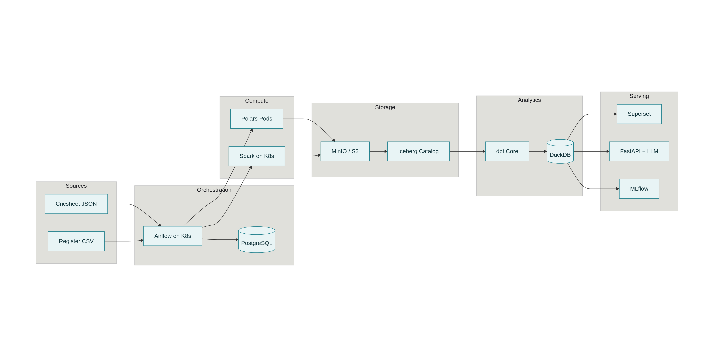
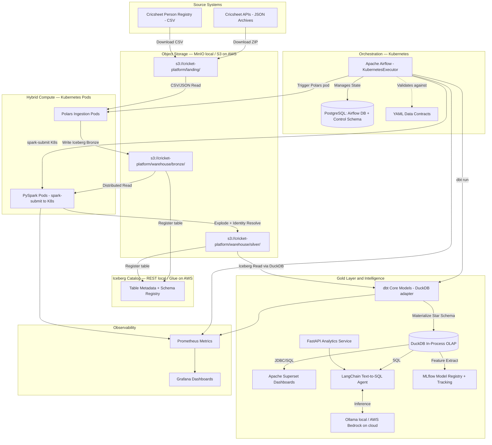
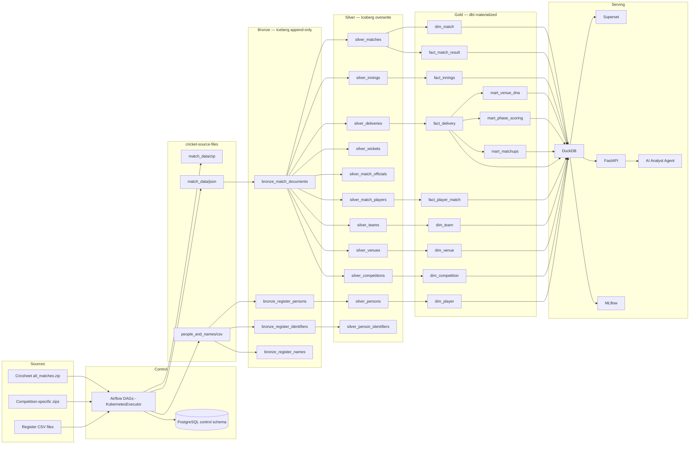

# Cricket Intelligence Platform — Comprehensive High Level Design and High Level Architecture

> Document type: HLD / HLA
> Intended audience: engineering review, architecture discussions, implementation planning, portfolio documentation, interview preparation
> Architecture style: open-source, cloud-agnostic, lakehouse-oriented, analytics-first, AI/ML extensible, Kubernetes-native compute, AWS cloud-deployable

## 1. Executive overview

The Cricket Intelligence Platform is a cloud-agnostic, open-source data platform designed to ingest, process, model, and serve historical cricket data from Cricsheet at scale. Cricsheet publishes structured match data in JSON as its main format, with legacy YAML and experimental CSV/XML variants, and the platform's downloads page currently exposes more than 21,000 matches in the full archive. The source ecosystem also includes the Cricsheet Register, which provides unique identifiers, cross-site identifier mappings, and name variations for thousands of cricket people, making proper identity resolution feasible instead of relying on raw player-name strings.

This platform is intentionally designed to look and behave like a modern product-company data platform rather than a hobby analytics project. It combines an object-store-based lakehouse, workload-specific compute engines, governed analytics modeling, business-facing dashboards, AI-assisted analytical experiences, and MLOps capabilities in a single coherent architecture.

The architectural goal is not only to build something functional, but to create a platform that sharpens the right skills for long-term career growth: distributed data processing, open table formats, Kubernetes-native compute orchestration, warehouse-style modeling, quality engineering, observability, AI enablement, and ML lifecycle management. The platform is developed locally on a MacBook M3/M5 (32GB RAM) and deployed to AWS with near-zero code changes, following a **develop local → deploy cloud** strategy.

## 2. Vision and goals

### 2.1 Vision

Build a reusable **Cricket Intelligence Platform** that transforms public structured cricket data into a trusted analytical and intelligent product foundation. The system should support both current needs, such as dashboards and curated analytics, and future expansion into conversational analytics, predictive modeling, and eventually streaming or near-real-time use cases.

### 2.2 Primary objectives

- Build a portfolio-grade open-source platform that demonstrates senior-level data engineering architecture and implementation choices.
- Use technologies that are relevant to modern startups and product companies while avoiding tight vendor lock-in.
- Separate storage, compute, orchestration, modeling, serving, and observability concerns so the platform can evolve without full rewrites.
- Build a governed analytical layer that can power dashboards, APIs, AI agents, and ML workflows consistently.
- Design a **two-plane architecture** (stateful infrastructure on Docker Compose; workloads on Kubernetes) that maps cleanly to AWS cloud services on migration.

### 2.3 Success criteria

A successful v1 should:
- ingest the full Cricsheet historical archive reproducibly,
- model the Cricsheet Register as a canonical identity layer,
- produce Bronze, Silver, and Gold datasets on Apache Iceberg open table format,
- expose curated marts for dashboards and downstream consumers,
- implement observable, testable, restartable pipelines with DQ gates at every layer boundary,
- run Spark jobs as ephemeral Kubernetes pods (local cluster and EKS-compatible),
- deploy to AWS with a single config change per component and no business logic rewrites,
- support at least one AI assistant use case and one ML use case grounded on curated Gold data.

## 3. Architectural principles

### 3.1 Decoupled storage and compute

The platform separates physical data storage from processing engines so that data remains durable and reusable even if the compute layer changes over time. This is the same principle behind modern lakehouse architectures, where multiple engines can read and write shared analytical tables without data duplication or deep coupling to one vendor runtime.

### 3.2 Open format first

Apache Iceberg is chosen as the primary table format because it supports in-place schema evolution, partition evolution, and snapshot-based table management while remaining open and multi-engine compatible. That matters because this project is explicitly intended to grow across multiple compute and serving patterns over time, and because Iceberg has native support on AWS Glue, EMR, Athena, and S3.

### 3.3 Right tool for each workload

Not all workloads in this system are the same. Ingestion of thousands of relatively small structured files has different performance characteristics than multi-stage historical joins or sub-second analytical querying, so the architecture intentionally uses different engines for different jobs.

### 3.4 Contract-driven movement across layers

Data is allowed to advance from one layer to the next only after satisfying structural and semantic checks. This principle makes the platform more trustworthy and also gives strong interview talking points around data quality and engineering discipline.

### 3.5 Analytics as a product

The Gold layer is treated as a product interface rather than as an incidental transformation output. Dashboards, APIs, AI assistants, and ML feature extraction all depend on this governed analytical contract.

### 3.6 AI and ML must be grounded

AI and ML layers sit on top of curated marts, dimensions, and feature views rather than raw JSON files. That minimizes hallucination risk for AI and leakage or inconsistency risk for ML.

### 3.7 Two-plane deployment model

The platform separates stateful infrastructure (storage, metadata, databases) from workloads (Spark jobs, Airflow task pods, ML training, API serving). Stateful services run in Docker Compose locally and as managed AWS services in production. Workloads run on Kubernetes locally (Docker Desktop K8s) and on EKS in production. This separation means Kubernetes manifests and Spark submit commands are cloud-portable with a single endpoint change.

### 3.8 Develop local, deploy cloud

Every local component is chosen to have a direct AWS cloud equivalent. No local-only tooling is introduced without a clear migration path. The platform transitions from local Docker Compose + Kubernetes to AWS S3 + RDS + EKS + EMR + Glue Catalog by changing environment variables and endpoint URLs, not business logic.

## 4. Source system understanding

### 4.1 Cricsheet as the primary source

Cricsheet provides freely available structured cricket data, including ball-by-ball match records and identifier mapping through the Register. The downloads page offers archives by match type, competition, gender, year, country, and team, and the "all matches" archive includes over 21,600 matches with a small number withheld.

### 4.2 Formats and implications

Cricsheet supports JSON, YAML, XML, and two CSV variants, but JSON is now the modern default and should be treated as the canonical ingestion format for the platform. This is important because future-proofing the project means optimizing for the actively maintained source structure rather than the legacy format.

### 4.3 Register as identity backbone

The Cricsheet Register contains unique identifiers for more than 17,700 people, tens of thousands of identifiers from 12 external sources, and thousands of name variations. This is one of the strongest differentiators of the project because it enables a robust `dim_person`, crosswalk tables, and entity resolution logic that most sports-data side projects ignore.

### 4.4 Source data characteristics

The JSON files are nested and hierarchical, with match metadata, participant identities, innings, overs, deliveries, wickets, extras, officials, and outcomes represented within the same source document. This implies:
- a raw landing and Bronze design that preserves source fidelity,
- a Silver normalization process that can explode nested arrays safely using PySpark,
- and an analytical design where the delivery fact table becomes the most important grain for deep cricket analytics.

## 5. Scope

### 5.1 In scope for v1

- Historical batch ingestion from Cricsheet downloads.
- Register ingestion and identity modeling (first vertical slice).
- Bronze, Silver, and Gold layers on Apache Iceberg open table format.
- Workflow orchestration with Airflow using KubernetesExecutor.
- Workload-specific transformation using Polars (ingestion) and PySpark-on-Kubernetes (transformation).
- dbt Core modeling and tests for Gold marts backed by DuckDB.
- Superset dashboards for executive and analyst use cases.
- MLflow-managed first predictive workflow.
- FastAPI and local LLM-backed AI analytical assistant (Ollama locally, AWS Bedrock on cloud).
- Observability and quality monitoring with Prometheus and Grafana.
- Full AWS cloud deployment with Terraform IaC.

### 5.2 Deferred scope

- Real-time scoring ingestion from live feeds.
- Kafka-centered streaming architecture.
- Multi-tenant SaaS exposure for external users.
- External commercial enrichment feeds.
- Kubeflow-based ML pipelines (MLflow covers v1 MLOps needs).

## 6. High level architecture

### 6.1 Logical platform view

The platform is divided into nine logical layers:

1. **Source layer** — Cricsheet archives and Register files.
2. **Control and orchestration layer** — Airflow (KubernetesExecutor) plus PostgreSQL control metadata.
3. **Raw and lake storage layer** — MinIO locally (S3 in AWS) as S3-compatible object storage.
4. **Open table layer** — Apache Iceberg-managed tables (Iceberg REST Catalog locally, AWS Glue Catalog in production).
5. **Compute and transformation layer** — Polars for ingestion, PySpark-on-Kubernetes for Silver transformation.
6. **Analytics engineering layer** — dbt Core for SQL models, tests, and docs (DuckDB adapter).
7. **Consumption and intelligence layer** — DuckDB, Superset, FastAPI, Ollama/Bedrock, LangChain, MLflow.
8. **Observability layer** — Prometheus, Grafana, data quality outputs, and run metadata.
9. **Cloud infrastructure layer** — AWS S3, RDS, EKS, EMR on EKS, Glue Catalog, Terraform IaC.

### 6.2 Two-plane deployment architecture

The platform uses a **two-plane model** that separates stateful infrastructure from ephemeral workloads:

```
┌──────────────────────────────────────────────────────────────────┐
│  INFRASTRUCTURE PLANE  (stateful — always-on services)           │
│  Local:  Docker Compose  →  MinIO + PostgreSQL + Iceberg REST    │
│                              + Superset + Prometheus + Grafana   │
│  Cloud:  AWS Managed     →  S3 + RDS + Glue Catalog              │
│                              + Superset on ECS + CloudWatch      │
└──────────────────────────────────────────────────────────────────┘
                    ↕  S3 API / JDBC / REST
┌──────────────────────────────────────────────────────────────────┐
│  WORKLOAD PLANE  (ephemeral — pod-per-task compute)              │
│  Local:  Docker Desktop K8s  →  Airflow + Spark Pods             │
│                                  + MLflow + FastAPI + Ollama     │
│  Cloud:  AWS EKS             →  Airflow + EMR on EKS             │
│                                  + MLflow + FastAPI + Bedrock    │
└──────────────────────────────────────────────────────────────────┘
```



### 6.3 System architecture diagram



### 6.4 Detailed data flow diagram



## 7. Technology stack and decision rationale

### 7.1 Full stack

| Layer | Local (Dev) | Cloud (AWS) | Notes |
|---|---|---|---|
| Object storage | MinIO (pinned, maintenance mode) | **AWS S3** | S3 API — endpoint URL change only |
| Table format | Apache Iceberg | Apache Iceberg | Native on S3 + Glue |
| Iceberg catalog | REST Catalog (Docker) | **AWS Glue Catalog** | One env var change |
| Orchestration | Airflow KubernetesExecutor | **Airflow on EKS** (self-hosted) | Same DAGs, same manifests |
| Container orchestration | Docker Desktop Kubernetes | **AWS EKS** | Same Helm charts |
| Ingestion compute | Polars (K8s pod) | Polars (EKS pod) | Container image unchanged |
| Transform compute | PySpark on K8s | **EMR on EKS** | spark-submit target change only |
| Analytical engine | DuckDB | DuckDB | In-process, no infra change |
| Data modeling | dbt Core (DuckDB adapter) | dbt Core (Athena adapter optional) | profiles.yml change |
| BI | Apache Superset | Superset on ECS Fargate | Docker image unchanged |
| MLOps | MLflow (K8s pod) | MLflow on EKS + S3 artifacts | Artifact store = S3 |
| AI — inference | Ollama (K8s pod) | **AWS Bedrock** | FastAPI abstraction layer |
| AI — orchestration | LangChain + FastAPI | LangChain + FastAPI (EKS) | Code unchanged |
| Monitoring | Prometheus + Grafana | Amazon Managed Grafana + CloudWatch | Optional swap |
| CI/CD | GitHub Actions | GitHub Actions | Identical |
| Control metadata | PostgreSQL (Docker) | **AWS RDS PostgreSQL** | Same schema, same DDL |
| IaC | Docker Compose + Makefile | **Terraform** (EKS, S3, RDS, IAM) | Separate `infra/terraform/` |

### 7.2 Why Iceberg over Delta Lake

Iceberg is the better long-term architectural fit because the platform is explicitly multi-engine and cloud-agnostic. Iceberg supports schema evolution and partition evolution in-place, without forcing costly rewrites or new-table migrations. It has native support on AWS Glue Catalog, EMR, and Athena, which is directly on the cloud migration path. Delta Lake would require Databricks or Unity Catalog for full feature access, introducing vendor dependency.

### 7.3 Why Polars + Spark + DuckDB together

This combination is defensible when framed by workload separation:

- **Polars** — file-heavy, CPU-efficient local ingest of thousands of small JSON/CSV files. No JVM startup cost. Runs as lightweight K8s pods.
- **PySpark on Kubernetes** — full-history batch transformations, nested JSON explosion, complex multi-table joins at scale. Ephemeral driver + executor pods — no idle cluster cost.
- **DuckDB** — in-process OLAP for dbt execution, Gold-layer serving, sub-second Superset queries. No server to manage.

This is a strong interview story because it shows engine selection based on job shape rather than tool fashion.

### 7.4 Why Kubernetes for compute (not just Docker Compose)

Kubernetes is introduced for compute workloads only — not stateful infrastructure. The benefits are:

- **Task-level isolation** — a crashing Spark job cannot OOM-kill your DQ check tasks (KubernetesExecutor).
- **Ephemeral Spark** — spark-submit creates driver + executor pods per job, tears them down after. No idle cluster cost.
- **Cloud portability** — `k8s://docker.internal:6443` → `k8s://eks.amazonaws.com` is one config line change.
- **Resource limits** — each pod gets declared CPU/memory requests, preventing MacBook thrashing.

Stateful services (MinIO, PostgreSQL, Superset, Grafana) stay in Docker Compose locally and move to AWS managed services on cloud.

### 7.5 MinIO maintenance mode notice

MinIO entered maintenance mode in December 2025. No new features are being developed and security patches are evaluated case-by-case. The local dev environment uses a pinned MinIO version, which remains stable for development purposes. All storage paths and `boto3`/`pyiceberg` calls use standard S3 API — migrating to AWS S3 requires only an endpoint URL change. Alternative S3-compatible stores for self-hosted scenarios include **RustFS** (Apache 2.0, 2.3× faster on small objects) and **SeaweedFS** (battle-tested, production-grade).

## 8. Kubernetes architecture detail

### 8.1 Local cluster setup

Use Docker Desktop's built-in Kubernetes on Apple Silicon (M3/M5). It runs natively without a VM layer, saving ~1–2GB RAM vs Minikube.

```bash
# Enable: Docker Desktop → Settings → Kubernetes → Enable Kubernetes
# Allocate: 20GB RAM, 8 CPUs to Docker Desktop

kubectl cluster-info  # verify
```

### 8.2 Namespace layout

```
cricket-platform/
├── namespace: airflow       # Airflow scheduler, webserver, task pods
├── namespace: spark         # Spark driver + executor pods (ephemeral)
├── namespace: serving       # FastAPI, MLflow, Ollama
└── namespace: monitoring    # Prometheus, Grafana (optional, can stay Compose)
```

### 8.3 Airflow KubernetesExecutor

Each Airflow task spawns its own isolated pod, runs, and terminates. Light tasks (DQ checks, downloads) use the default pod spec; heavy tasks (Spark, ML training) use resource-bumped pod specs via `KubernetesPodOperator`.

```yaml
# airflow.cfg overrides
AIRFLOW__CORE__EXECUTOR: KubernetesExecutor
AIRFLOW__KUBERNETES__NAMESPACE: airflow
AIRFLOW__KUBERNETES__IN_CLUSTER: "true"
AIRFLOW__KUBERNETES__WORKER_CONTAINER_REPOSITORY: apache/airflow
AIRFLOW__KUBERNETES__WORKER_CONTAINER_TAG: 2.9-python3.11
```

### 8.4 PySpark on Kubernetes

Spark jobs are submitted directly to the Kubernetes API. No persistent Spark cluster — driver and executor pods are created per job and destroyed on completion.

```bash
spark-submit \
  --master k8s://https://kubernetes.docker.internal:6443 \   # → EKS endpoint on cloud
  --deploy-mode cluster \
  --name silver-deliveries \
  --conf spark.executor.instances=2 \
  --conf spark.executor.memory=4g \
  --conf spark.kubernetes.namespace=spark \
  --conf spark.kubernetes.authenticate.driver.serviceAccountName=spark \
  --conf spark.kubernetes.container.image=cricket-platform/spark:latest \
  local:///app/platform/transform/spark/silver/deliveries.py
```

### 8.5 RBAC setup (one-time)

```bash
kubectl create namespace spark
kubectl create serviceaccount spark -n spark
kubectl create clusterrolebinding spark-role \
  --clusterrole=edit \
  --serviceaccount=spark:spark -n spark
```

## 9. Medallion data flow strategy

### 9.1 Source files bucket

The `cricket-source-files` bucket stores original archives and extracted raw files exactly as obtained from Cricsheet. It is the first durable boundary and the reprocessing fallback point.

**Paths:**
- `s3://cricket-source-files/match_data/zip/snapshot_date=.../all_json.zip`
- `s3://cricket-source-files/match_data/json/snapshot_date=.../{match_id}.json`
- `s3://cricket-source-files/people_and_names/csv/snapshot_date=.../people.csv`
- `s3://cricket-source-files/people_and_names/csv/snapshot_date=.../names.csv`

### 9.2 Bronze layer

Bronze stores minimally processed but queryable representations of source records.

**Characteristics:**
- append-only Iceberg tables,
- schema-tolerant (all columns ingested as String for fidelity),
- includes `_snapshot_date`, `_pipeline_run_id`, `_ingested_at`, `_row_hash` metadata columns,
- written by Polars pods.

**Bronze tables:**
- `bronze_match_documents`
- `bronze_register_people`
- `bronze_register_identifiers`
- `bronze_register_name_variations`

### 9.3 Silver layer

Silver is the canonical integration layer. Nested source documents are exploded into relational structures, types are standardized, identity mappings are resolved, and data contracts are enforced.

**Written by:** PySpark pods (match data), Polars pods (Register data — no Spark needed).

**Core Silver tables:**
- `silver_matches`, `silver_innings`, `silver_deliveries`, `silver_wickets`
- `silver_teams`, `silver_venues`, `silver_competitions`
- `silver_persons`, `silver_person_identifiers`, `silver_name_variations`
- `silver_match_players`, `silver_match_officials`

### 9.4 Gold layer

Gold contains business-ready star-schema tables and higher-order marts optimized for analytical and AI/ML consumption. Written by dbt Core using DuckDB adapter reading from Silver Iceberg tables.

**Core Gold dimensions:** `dim_player`, `dim_match`, `dim_team`, `dim_venue`, `dim_competition`, `dim_date`

**Core Gold facts:** `fact_delivery`, `fact_innings`, `fact_match_result`, `fact_player_match`

**Analytical marts:** `mart_player_batting`, `mart_player_bowling`, `mart_team_performance`, `mart_venue_dna`, `mart_phase_scoring`, `mart_toss_outcome`, `mart_matchup_analysis`

## 10. Canonical data model

### 10.1 Core entity model

- Person, Team, Venue, Competition, Match, Innings, Delivery, Wicket event, Official assignment, Player participation, External identifier, Name variation

### 10.2 Grain choices

| Table | Grain | Why it matters |
|---|---|---|
| `fact_delivery` | one row per ball bowled | deepest cricket analytics, phase metrics, strike rate, economy, wicket events |
| `fact_innings` | one row per innings | scoreboard-style analysis and match summaries |
| `fact_match_result` | one row per match | win/loss, toss, venue, season, margin analysis |
| `fact_player_match` | one row per player per match | player-level feature extraction and performance summaries |

### 10.3 Identity model

The identity model does not depend on string name fields in match files as business keys:
- `person_id` from the Register is the canonical key where available,
- external identifiers are managed in `silver_person_identifiers` crosswalk table,
- name variations are in `silver_name_variations` as resolution artifacts, not primary keys.

This supports historical consistency, downstream enrichment, and AI-safe entity referencing.

## 11. Orchestration and control plane

### 11.1 Airflow DAG inventory

| DAG | Trigger | Compute |
|---|---|---|
| `ingest_people_and_names_bronze` | @weekly (Sun 00:30 UTC) | Polars + PyIceberg |
| `ingest_people_and_names_silver` | auto (bronze) / @weekly (Sun 01:30 UTC) | Polars + PyIceberg |
| `ingest_all_match_data_bronze` | manual | Polars + PyIceberg |
| `ingest_all_match_data_silver` | auto (bronze) / manual | PySpark + Iceberg |
| `ingest_all_match_data_gold` | auto (silver) / manual | dbt Core (DuckDB) |
| `ingest_two_day_match_data_bronze` | @daily (02:00 UTC) | Polars + PyIceberg |
| `ingest_two_day_match_data_silver` | auto (bronze) / manual | PySpark + Iceberg |
| `ingest_two_day_match_data_gold` | auto (silver) / manual | dbt Core (DuckDB) |
| `dag_run_quality_checks` | after each layer | Python |
| `dag_refresh_serving_layer` | after gold | DuckDB |
| `dag_train_ml_model` | @monthly | PySpark + MLflow |
| `dag_refresh_ai_metadata` | after gold | Python |

### 11.2 Control metadata (PostgreSQL `control` schema)

- `control.register_ingestion_log` — download metadata, checksums, row counts, status
- `control.register_schema_versions` — column fingerprints for schema drift detection
- `control.dq_results` — all DQ check results per run per layer
- `control.register_change_log` — delta counts between snapshots

## 12. Data quality and observability

### 12.1 DQ framework — 31 checks across 3 layers

**Severity levels:** 🚫 BLOCK (pipeline halts) | ⚠️ WARN (logged, continues) | 🔔 ALERT (Slack/PagerDuty) | 📋 LOG (audit only)

| Layer | Check IDs | Count | Key checks |
|---|---|---|---|
| Landing | LND-001 → LND-008 | 8 | HTTP 200, schema drift, row count floor, identifier regex |
| Bronze | BRZ-001 → BRZ-009 | 9 | Null PK, uniqueness, row count match vs landing, idempotency guard |
| Silver | SLV-001 → SLV-014 | 14 | Referential integrity across tables, cross-file orphan check, coverage |

### 12.2 Observability design

Prometheus scrapes metrics from Airflow, Spark pods, and custom job exporters. Grafana provides operational dashboards.

**Key metrics:**
- DAG run duration, failed task count, files ingested per run
- Rows written per table, table freshness lag, DQ failures by type
- Spark executor CPU/memory, pod restart count
- Unmatched person count, dashboard refresh latency
- `register_people_row_count`, `register_schema_drift_flag`, `register_changed_rows`

## 13. Analytics and BI architecture

Superset sits on top of curated Gold tables or marts only — never raw or Silver layers.

### 13.1 Executive dashboard
KPI cards, season-level views: matches processed, scoring trends, toss vs result trends, venue run environment, team form and win patterns.

### 13.2 Analyst dashboard
Deep drilldowns: batter-vs-bowler matchups, phase-wise scoring, venue-specific patterns, powerplay vs death-over performance, player trend analysis across seasons.

## 14. AI architecture

### 14.1 AI analyst copilot flow

1. User asks a natural language question
2. FastAPI receives the request
3. LangChain maps the question to approved query patterns and Gold mart schema context
4. Ollama (local) / AWS Bedrock (cloud) runs inference for reasoning or narration
5. DuckDB executes only allowed analytical queries (read-only, Gold marts only)
6. System returns both data and natural language explanation

### 14.2 Guardrails
- Restrict AI access to Gold marts only via read-only DuckDB connection
- Log all prompts and generated SQL to `control.ai_query_log`
- Prefer semantic templates before free-form SQL
- Validate entity references through `dim_player` and `dim_team` dimensions

### 14.3 Example use cases
- "Which venues historically favor chasing teams in T20s?"
- "Show top 10 death-over bowlers in IPL since 2020."
- "Summarize Rohit Sharma's powerplay scoring trend by season."

## 15. ML and MLOps architecture

### 15.1 First ML use case

**Win probability at the end of each over** — intuitive business value, structured historical features, easy to explain in interviews.

### 15.2 ML lifecycle
1. Extract features from Gold views (`fact_delivery`, `fact_innings`)
2. Train baseline XGBoost model in Python
3. Log metrics, params, and artifacts in MLflow (S3 artifact store)
4. Register winning model versions in MLflow Model Registry
5. Batch-score historical datasets, surface into Superset or FastAPI

### 15.3 Candidate features
- current score, wickets lost, overs completed, required rate
- venue, innings number, toss decision
- batting team strength proxy, bowling team strength proxy

## 16. Cloud deployment architecture — AWS

### 16.1 Develop local → deploy cloud strategy

Every local component maps directly to an AWS service with a single config change:

| Local | AWS Equivalent | Migration effort |
|---|---|---|
| MinIO (S3 API) | **AWS S3** | Endpoint URL + IAM role |
| PostgreSQL (Docker) | **AWS RDS PostgreSQL** | Connection string only |
| Iceberg REST Catalog | **AWS Glue Catalog** | `ICEBERG_CATALOG_URI` env var |
| Airflow (K8s local) | **Airflow on EKS** (self-hosted) | Helm chart, same DAGs |
| PySpark on K8s | **EMR on EKS** | spark-submit master endpoint |
| Superset (Docker) | **Superset on ECS Fargate** | Container image, task def |
| MLflow (K8s pod) | **MLflow on EKS + S3** | S3 artifact store config |
| Ollama (K8s pod) | **AWS Bedrock** | FastAPI abstraction swap |
| Prometheus + Grafana | **Amazon Managed Grafana** | Datasource config |
| Docker Compose | **Terraform IaC** | `infra/terraform/` |

### 16.2 Three-stage cloud migration path

**Stage 1 — Local (Months 1–3):** Docker Compose for infrastructure + Docker Desktop K8s for workloads. Full platform working end-to-end.

**Stage 2 — Cloud lift-and-shift (After local validation):**
```
AWS S3              ← replaces MinIO
AWS RDS PostgreSQL  ← replaces local PostgreSQL
AWS Glue Catalog    ← replaces Iceberg REST
Airflow on EKS      ← same DAGs, KubernetesExecutor unchanged
EMR on EKS          ← same PySpark code, spark-submit target changes
```

**Stage 3 — Cloud-native optimisation:**
```
EMR Serverless      ← bursty Spark workloads, no cluster management
AWS Bedrock         ← replaces Ollama for LLM inference
MWAA                ← only if ops overhead justifies cost (~$200-400/mo)
```

### 16.3 AWS infrastructure components (Terraform)

```
infra/terraform/
├── modules/
│   ├── s3/          # cricket-platform bucket, lifecycle rules
│   ├── rds/         # PostgreSQL t3.micro, parameter group
│   ├── eks/         # EKS cluster, node groups (spot instances)
│   ├── emr/         # EMR on EKS virtual cluster
│   ├── iam/         # IRSA roles for S3, Glue, EKS pods
│   └── glue/        # Glue catalog database, Iceberg table registration
└── envs/
    ├── dev/
    └── prod/
```

### 16.4 Estimated AWS monthly cost (solo-operated, weekly batch)

| Service | Spec | Est. Monthly |
|---|---|---|
| S3 | 50GB storage + requests | ~$2 |
| RDS PostgreSQL | t3.micro, 20GB | ~$15 |
| EKS cluster | 2× t3.medium spot nodes | ~$30–50 |
| EMR on EKS | Weekly Silver batch job | ~$5–15 per run |
| ECS Fargate (Superset) | 0.5 vCPU / 1GB | ~$10–20 |
| MLflow on EKS | Shared node | ~$5–10 |
| **Total** | | **~$70–120/month** |

> Note: MWAA adds ~$200–400/month. Self-hosted Airflow on EKS with spot instances is recommended at this scale.

## 17. Repository structure

```text
cricket-intelligence-platform/
├── docs/
│   ├── architecture/
│   │   ├── hld-hla.md
│   │   ├── data-model.md
│   │   ├── data-flow.md
│   │   └── service-interactions.md
│   ├── adr/
│   ├── runbooks/
│   └── product/
├── infra/
│   ├── compose/             # compose.base.yml, compose.dev.yml
│   ├── bootstrap/           # create-buckets.sh, init-metastore.sql
│   ├── docker/              # Dockerfiles for airflow, spark, api
│   ├── iceberg/             # catalog config, table properties
│   ├── k8s/                 # Kubernetes manifests, Helm values
│   │   ├── namespaces/
│   │   ├── airflow/
│   │   ├── spark/
│   │   └── serving/
│   └── terraform/           # AWS IaC (EKS, S3, RDS, Glue, IAM)
│       ├── modules/
│       └── envs/
├── orchestration/
│   └── airflow/
│       ├── dags/
│       ├── plugins/
│       └── include/
├── platform/
│   ├── common/              # settings, exceptions, logging, contracts
│   ├── ingestion/           # cricsheet/, register/, io/
│   ├── transform/
│   │   ├── polars/          # bronze/, silver/ (register pipeline)
│   │   ├── spark/           # silver/ (match explosion)
│   │   └── shared/          # iceberg writers, readers
│   ├── quality/             # dq_landing, dq_bronze, dq_silver
│   ├── ml/                  # features/, training/, scoring/, tracking/
│   └── serving/
│       ├── api/             # FastAPI
│       ├── duckdb/          # views, refresh
│       └── ai/              # chains, retrieval, prompt_registry
├── models/
│   └── dbt/                 # staging, intermediate, marts, tests, docs
├── apps/
│   ├── superset/
│   └── ai-studio/
├── observability/
│   ├── prometheus/
│   ├── grafana/
│   └── alerts/
├── notebooks/
├── tests/
│   ├── unit/
│   ├── integration/
│   ├── data_quality/
│   └── fixtures/
├── .github/workflows/       # CI, dbt-ci, docs
├── .env.example
├── docker-compose.yml
├── Makefile
└── README.md
```

## 18. Non-functional requirements

| Requirement | Design intent |
|---|---|
| Reproducibility | One-command bootstrap (`make up && make bootstrap`), deterministic ingestion, documented backfill runbooks. |
| Portability | Open storage (S3 API), open table format (Iceberg), Kubernetes manifests — all cloud-portable. |
| Maintainability | Clear repo boundaries, ADRs, runbooks, tests, CI checks, solo-operator-friendly. |
| Trust | DQ gates at every layer boundary (31 checks), identity resolution first-class concern. |
| Performance | Engine specialization: Polars for I/O, Spark for heavy joins, DuckDB for serving. |
| Scalability | Iceberg + Spark-on-K8s enables horizontal scaling; EKS node pools expand on AWS. |
| Cloud portability | Each local component maps to AWS equivalent with endpoint/config change only. |
| Explainability | Every major design choice justified and interview-defensible. |

## 19. Risks and mitigations

| Risk | Impact | Mitigation |
|---|---|---|
| MinIO maintenance mode | Medium | Pinned local version for dev; AWS S3 as cloud target; RustFS as self-hosted alternative. |
| Kubernetes local overhead | Medium | Docker Desktop K8s on 32GB M3/M5; infrastructure plane stays in Compose. |
| Over-engineering v1 | High | Deliver in phases: registry pipeline → match ingest → Silver → Gold → BI before AI/ML. |
| Too many compute engines | Medium | Clear workload boundaries documented; Polars (ingestion), Spark (explosion), DuckDB (serving). |
| Identity gaps or mismatches | High | Register ingestion is first vertical slice; unmatched-record workflows built in. |
| AI assistant hallucination | Medium | Restrict to Gold marts only; read-only DuckDB connection; query logging. |
| AWS cost overrun | Medium | Spot instances on EKS; EMR Serverless for bursty jobs; monthly cost ceiling alerting. |
| Weak data contracts | High | DQ BLOCK checks prevent bad data from advancing; dbt tests on Gold layer. |

## 20. Recommended phased implementation path

### Phase 1 — Environment and foundation
Docker Compose infrastructure, Kubernetes local cluster, `.env.example`, `pyproject.toml`, shared platform modules (`settings`, `exceptions`, `logging`, `enums`, `naming`, `minio`, `writers`, `readers`), bootstrap SQL, Makefile.

### Phase 2 — Registry pipeline (first vertical slice)
`ingest_people_and_names_bronze` + `ingest_people_and_names_silver` — download → landing → schema drift detection → Bronze Iceberg (Polars) → Silver identity tables (Polars) → DQ checks → control metadata. **This is the production-readiness baseline.**

### Phase 3 — Match ingestion and Silver explosion
`ingest_all_match_data_bronze` / `ingest_two_day_match_data_bronze` — 21k+ JSON files to Bronze (Polars) with audit-skip and revision tracking. `ingest_all_match_data_silver` / `ingest_two_day_match_data_silver` — PySpark nested JSON explosion to Silver matches, innings, deliveries, wickets, officials, players.

### Phase 4 — Gold layer and BI
`ingest_all_match_data_gold` / `ingest_two_day_match_data_gold` — dbt Core star schema materialisation (full-refresh and incremental). DuckDB serving layer. Metabase dashboards (executive + analyst personas).

### Phase 5 — AI and MLOps
FastAPI + LangChain + Ollama AI copilot. MLflow win-probability experiment. `dag_train_ml_model` + `dag_refresh_ai_metadata`.

### Phase 6 — AWS cloud deployment
Terraform IaC for EKS, S3, RDS, Glue Catalog, IAM. Migrate config endpoints. Validate full pipeline on AWS. Cost-optimise with spot instances and EMR Serverless.

### Phase 7 — Portfolio hardening
Observability dashboards, runbooks, CI/CD, interview demo assets, polished README diagrams, resume bullets.

## 21. Operational Note: Host vs. Container Environment Variables

A common source of configuration errors is the distinction between how the **Host machine** (your MacBook) and **Docker containers** reach services like PostgreSQL or MinIO.

- **From the Host:** Services are reachable via `localhost` (e.g., `POSTGRES_HOST=localhost`).
- **From inside Docker:** Services must be reached via their **Docker service names** defined in `docker-compose.yml` (e.g., `POSTGRES_HOST=postgres`).

The platform's `.env.example` and Compose files are configured to handle this by default:
- `.env` should generally use `localhost` for tools running on your host (IDE, local scripts).
- `docker-compose.yml` uses environment variable overrides (like `${POSTGRES_HOST:-postgres}`) to ensure containers use internal service names regardless of what is in your `.env`.

## 22. Architecture review summary

The most robust version of this architecture is an **open-source cricket lakehouse platform centered on AWS S3 / Apache Iceberg / Airflow (KubernetesExecutor) / Polars / PySpark-on-Kubernetes / DuckDB / dbt Core / Superset / MLflow / and a FastAPI-LangChain AI layer**. The platform is developed locally using Docker Compose for stateful infrastructure and Docker Desktop Kubernetes for compute workloads, then deployed to AWS EKS + EMR + S3 + Glue Catalog with near-zero code changes. This design is technically defensible, cloud-portable, Kubernetes-native, interview-ready, and demonstrates senior-level engineering discipline from ingestion through AI/ML serving.
