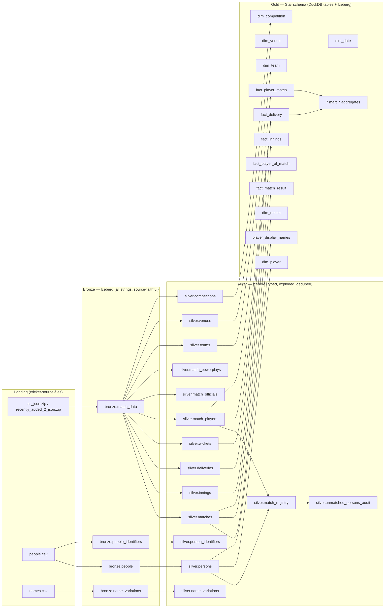
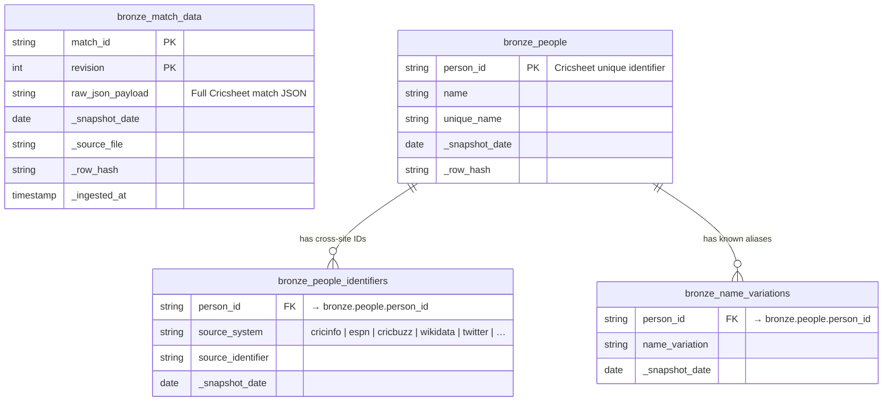
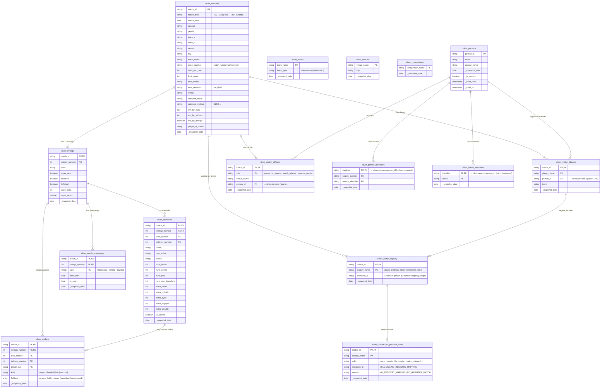
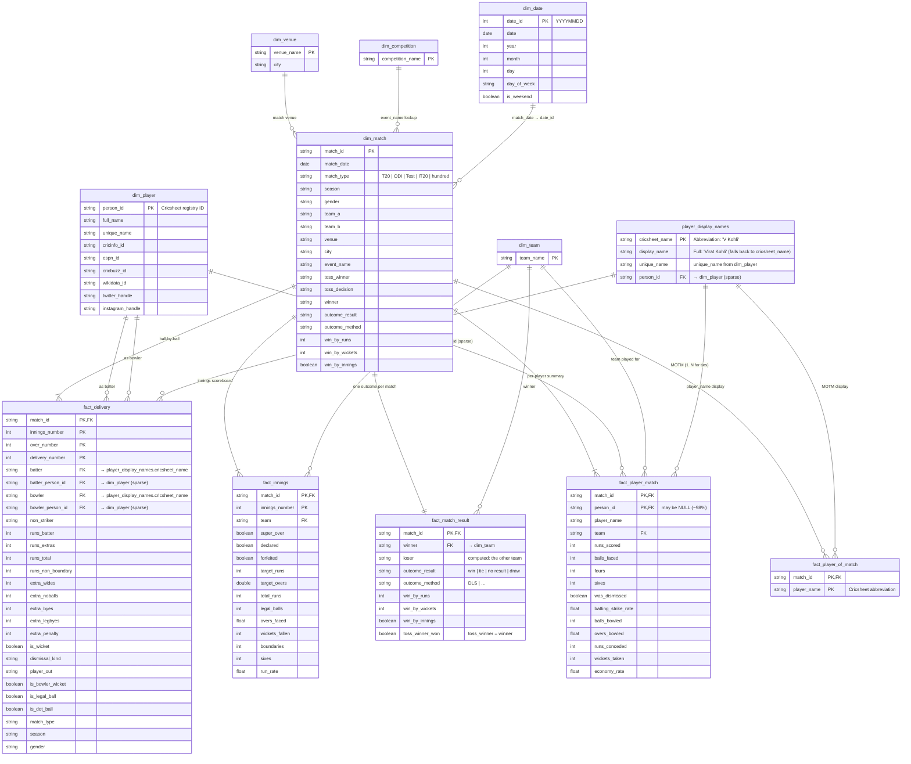

# Data Model — Cricket Intelligence Platform

End-to-end ER diagrams for the medallion lakehouse: **Bronze → Silver → Gold**.

All diagrams are Mermaid ERDs and render natively on GitHub. Edit the source in this file
to keep them in sync with `naming.py`, the Silver transforms, and the dbt models.

> **Source of truth**: table FQNs are defined in `src/cip/common/contracts/naming.py`
> (`TableName.BRONZE_TABLES`, `SILVER_TABLES`, `GOLD_TABLES`). dbt schemas live under
> `models/dbt/models/marts/{dimensions,facts,analytics}/_schema.yml`.

---

## 1. Layer overview

---

## 2. Bronze layer (raw, all-string)

> **Rule**: every column ingested as `String` (`infer_schema_length=0`). Type coercion is
> deferred to Silver. Match data is **append-only** with `(match_id, revision)` PK —
> corrections become new rows; Silver picks `MAX(revision)`.

**Notes**
- `bronze.match_data` is the only Bronze table holding match payloads. All match entities
  in Silver (`innings`, `deliveries`, `wickets`, …) are **exploded from this single JSON column** —
  no separate Bronze tables for each.
- `key_*` columns in `people.csv` are unpivoted long-form into `bronze.people_identifiers`,
  so new identifier sources (e.g. a future `key_bluesky`) flow through automatically.

---

## 3. Silver layer (typed, normalized)

Silver has two pipelines that produce 15 tables:

- **Match pipeline** (PySpark): explodes `bronze.match_data` into match-related entities
- **People & Names pipeline** (Polars): normalizes Cricsheet Register into person identity

**Notes**
- `silver.match_players.person_id` is **sparse** (~1–1.3%): Cricsheet match JSONs rarely embed
  registry IDs. Name-based joins in Gold close the gap at query time.
- `silver.wickets` is **not unique** on `(match_id, innings, over, delivery)` — multi-wicket
  deliveries (e.g. caught + run-out non-striker on the same ball) produce multiple rows.
  Gold `fact_delivery` dedups with `QUALIFY ROW_NUMBER()` before joining.
- Silver Iceberg accumulates `_snapshot_date` partitions across re-runs. Every Gold/dbt
  reader **must** filter `WHERE _snapshot_date = MAX(_snapshot_date)`.

---

## 4. Gold layer — star schema

Materialised as DuckDB tables under the `gold` schema (and Iceberg in the future).
Star schema: **6 dimensions + 5 facts + 7 marts + 1 bridge**.

### 4.1 Core star (dimensions + grain facts)

### 4.2 Aggregate marts

Pre-computed analytical marts for Metabase dashboards and the FastAPI serving layer.

```mermaid
erDiagram
    fact_delivery {
        string match_id PK
        int    innings_number PK
        int    over_number PK
        int    delivery_number PK
    }
    fact_player_match {
        string match_id PK
        string person_id PK
    }
    dim_player { string person_id PK }
    dim_team   { string team_name PK }
    dim_venue  { string venue_name PK }

    mart_player_batting {
        string person_id PK,FK
        string match_type PK
        string season PK
        int    runs
        int    balls_faced
        float  average
        float  strike_rate
        int    fifties
        int    hundreds
    }
    mart_player_bowling {
        string person_id PK,FK
        string match_type PK
        string season PK
        int    wickets
        float  economy
        float  average
        float  strike_rate
        int    four_wicket_hauls
        int    five_wicket_hauls
    }
    mart_team_performance {
        string team PK,FK
        string match_type PK
        string season PK
        int    matches_played
        int    matches_won
        int    matches_lost
        float  win_rate
    }
    mart_venue_dna {
        string venue PK,FK
        string match_type PK
        float  avg_first_innings_score
        float  chase_win_rate
        int    matches_hosted
    }
    mart_phase_scoring {
        string phase PK "powerplay | middle | death"
        string match_type PK
        float  avg_runs_per_over
        float  avg_balls_per_wicket
    }
    mart_toss_outcome {
        string toss_decision PK "bat | field"
        string match_type PK
        int    matches
        float  win_rate
    }
    mart_matchup_analysis {
        string batter_person_id PK,FK
        string bowler_person_id PK,FK
        int    balls_faced
        int    runs
        int    dismissals
        float  strike_rate
    }

    fact_delivery      ||--o{ mart_player_batting   : "aggregates"
    fact_delivery      ||--o{ mart_player_bowling   : "aggregates"
    fact_delivery      ||--o{ mart_phase_scoring    : "aggregates"
    fact_delivery      ||--o{ mart_matchup_analysis : "min 6 balls"
    fact_player_match  ||--o{ mart_player_batting   : "denormalised dims"
    fact_player_match  ||--o{ mart_player_bowling   : "denormalised dims"
    dim_player         ||--o{ mart_player_batting   : "person_id"
    dim_player         ||--o{ mart_player_bowling   : "person_id"
    dim_player         ||--o{ mart_matchup_analysis : "batter + bowler"
    dim_team           ||--o{ mart_team_performance : "team"
    dim_venue          ||--o{ mart_venue_dna        : "venue"
```

---

## 5. Grain reference

| Table | Grain (1 row per …) | Notes |
|---|---|---|
| `bronze.match_data` | `(match_id, revision)` | Append-only; corrections add new revisions |
| `bronze.people` | `(person_id, _snapshot_date)` | Re-ingested weekly |
| `silver.matches` | `match_id` | Latest revision only |
| `silver.innings` | `(match_id, innings_number)` | 1..N per match (Super Overs add rows) |
| `silver.deliveries` | `(match_id, innings, over, delivery)` | Unique on key |
| `silver.wickets` | `(match_id, innings, over, delivery, player_out)` | **Not** unique on delivery — multi-wicket balls exist |
| `silver.match_players` | `(match_id, player_name)` | Same name on both teams produces 2 rows |
| `dim_match` | `match_id` | Unique |
| `dim_player` | `person_id` | Unique (registry-deduped) |
| `fact_delivery` | `(match_id, innings, over, delivery)` | Wickets pre-deduped before LEFT JOIN |
| `fact_innings` | `(match_id, innings_number)` | |
| `fact_match_result` | `match_id` | Unique |
| `fact_player_match` | `(match_id, player_name)` | `person_id` may be NULL |
| `fact_player_of_match` | `(match_id, player_name)` | Tied matches → multiple MOTMs (EC-006) |

---

## 6. Maintaining this document

When adding a new table:

1. Add the FQN to `TableName.{BRONZE,SILVER,GOLD}_TABLES` in `src/cip/common/contracts/naming.py`.
2. Add the entity block + relationships to the matching layer's `erDiagram` above.
3. Add the grain to the table in §5.
4. Run `poetry run graphify update .` to refresh the knowledge graph.

When a relationship or grain changes, update both the diagram **and** the grain table —
they're checked together during code review.
